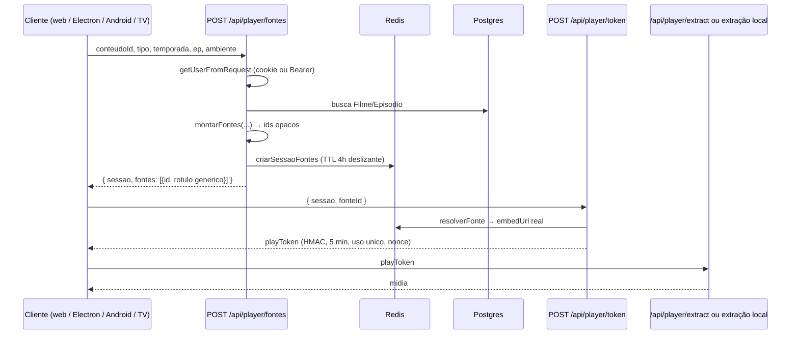
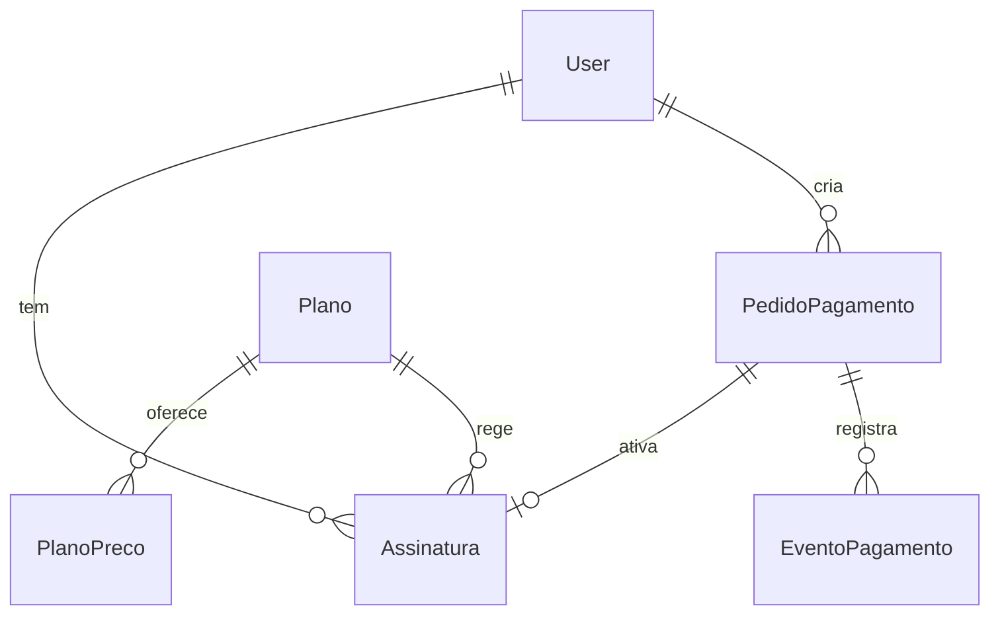
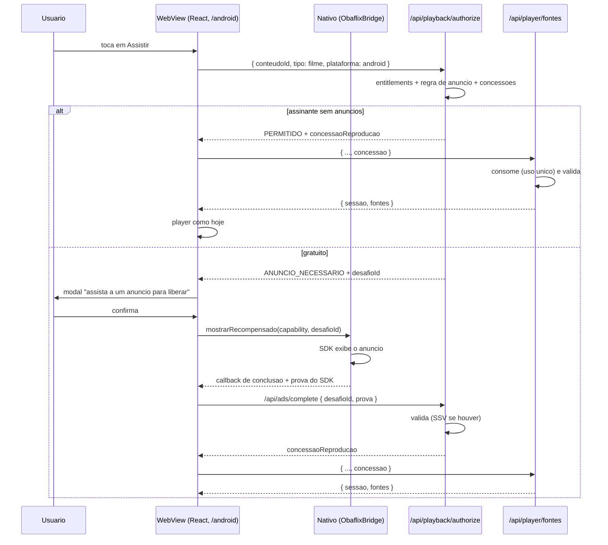
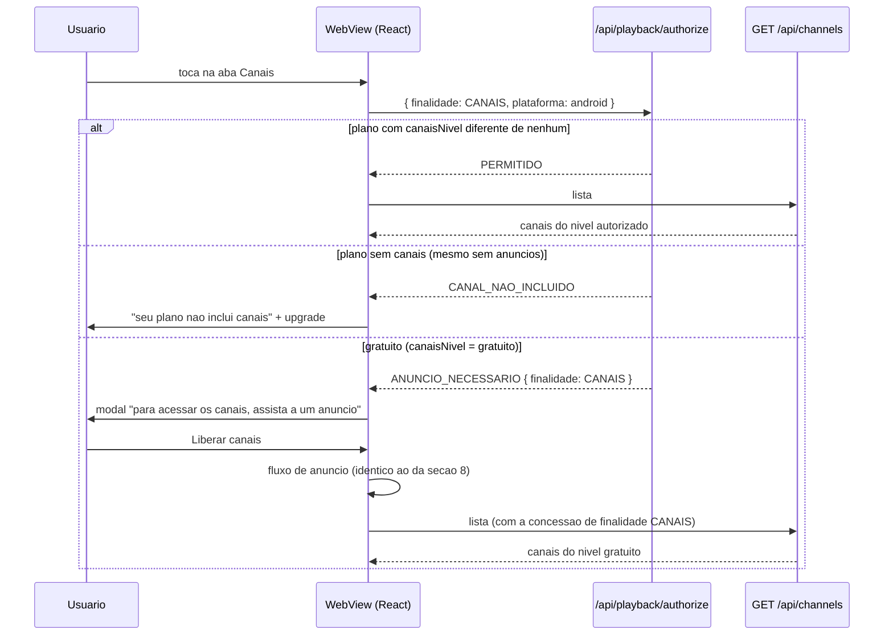
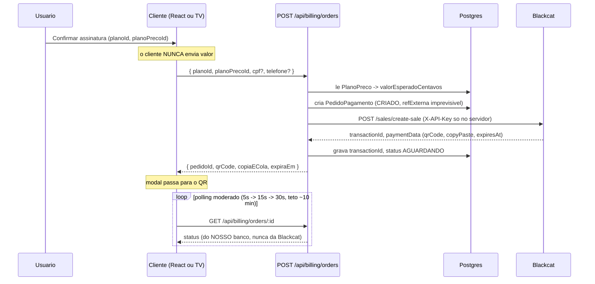

# Monetização, entitlements e autorização de conteúdo — diagnóstico e desenho

Inventário, arquitetura atual, arquitetura proposta, modelo de dados, contratos
e ameaças. É o desenho aprovado como base do projeto, e a referência que as
fases seguem.

**Sobre o tempo deste documento.** Ele foi escrito como diagnóstico, *antes* de
qualquer implementação, e o texto das seções conserva esse ponto de vista — daí
falar no futuro sobre tabelas e rotas. Desde então a **Fase 1 foi implementada**
e vive no mesmo PR: `Plano`, `PlanoPreco`, `Assinatura`, a migration
`20260910_planos_assinaturas` e o seed do plano padrão. Onde o texto e o código
divergirem, **o código é a verdade**; `docs/database.md` descreve o que existe
hoje no banco.

Continua verdadeiro, e é o que importa: **nada de pagamento, anúncio, canais,
entitlements em runtime ou bloqueio de reprodução foi escrito.** A Fase 1 criou
tabelas que nenhuma rota lê e um plano padrão que reproduz o comportamento
atual, campo a campo.

**Sobre as marcações [D].** Elas apontam decisões que dependiam de você. A maior
parte já foi tomada — a **seção 21** registra o estado de cada uma. Quando uma
seção diz "**[D-n]**", leia como "esta escolha está registrada em 21 com o que
foi decidido".

Nenhuma credencial real aparece aqui. Nenhum dado pessoal dos arquivos de
exemplo (Webcine, Blackcat) foi copiado.

---

## 1. Inventário do que já existe

### 1.1 O que **não** existe hoje

Auditei o repositório inteiro (`src`, `android`, `desktop`, `prisma`,
`scripts`) e todas as branches locais e remotas:

| Procurado | Resultado |
|---|---|
| Integração Unity Ads / AdMob / qualquer SDK de anúncio | **não existe** — nenhum arquivo, nenhuma dependência Gradle, nenhuma branch |
| Modelo `Plan`, `Subscription`, `Payment*` no Prisma | **não existe** |
| Qualquer chamada Blackcat, PIX ou gateway | **não existe** |
| Modelo `Profile` (perfis por conta) | **não existe** — `User` não tem perfis |
| Aba/rota de Canais | **não existe** |
| Qualquer noção de plano, `premium`, `isPremium` | **não existe** em nenhum cliente |

> **[D-1] Onde está o trabalho de Unity Ads?**
> Você mencionou trabalho iniciado. Ele não está neste repositório nem em
> nenhuma das 21 branches (locais + `origin/*`). Antes da fase de anúncios eu
> preciso saber se está em outro repositório, num zip local, ou se ainda não
> começou. Isso muda a fase inteira: auditar-e-preservar × integrar do zero.

### 1.2 O que já existe e é aproveitável (muito)

O projeto já tem, pronta e validada, quase toda a infraestrutura criptográfica
que a seção 10 do seu pedido descreve. **Não vamos construir isso de novo.**

| Peça existente | Arquivo | O que já faz | Uso na monetização |
|---|---|---|---|
| Ponto único de autorização | `src/lib/authSession.ts` | resolve usuário por cookie (site/Electron/móvel) **e** Bearer (TV) com um só `getToken`; separa credencial de TV de cookie copiado | ponto onde os entitlements passam a ser resolvidos |
| Token de reprodução | `src/lib/playTokens.ts` | HMAC-SHA256, TTL 5 min, **nonce**, ligado a `userId`+IP+embedUrl, **uso único** via `SET NX` no Redis, rotação semanal de chave com janela de transição | é literalmente o `PlaybackGrant` do seu item 10 — já existe |
| Limite de telas simultâneas | `playTokens.ts` → `registerStream` | sorted set no Redis por `expiresAt`, `MAX_CONCURRENT = 5` fixo | vira `entitlements.telasMax`, trocando a constante |
| Rate limit por usuário e por IP | `playTokens.ts`, `requestSecurity.ts` | `checkRateLimit`, `recordAbuseAttempt`, bloqueio temporário por IP | reaproveitado tal e qual nas rotas novas |
| Auditoria estruturada | `src/lib/auditLog.ts` | log JSON + contador Redis, union `AuditEvent` fechada | recebe os eventos novos de billing/ads/playback |
| Sessão de fontes | `src/lib/fontes.ts` | ids opacos, TTL deslizante 4h, nada de URL real no cliente | é o objeto que passa a nascer **só depois** da autorização |
| Integridade do APK | `android/.../security/AppIntegrity.kt` | verifica assinatura, e já documenta que **não é raiz de confiança** | permanece como defesa em profundidade, exatamente como está |
| Pareamento e revogação de TV | `TvDevice`, `TvRefreshToken` no Prisma | token opaco, família, detecção de reuso | base para "quantas telas" no lado da TV |
| Redis | `src/lib/redis.ts` (Upstash) | em produção é obrigatório — `getRedis()` lança se faltar; o stub in-memory só vale fora de produção | pode receber entitlements e concessões com segurança |

### 1.3 A descoberta que muda o desenho inteiro

**O app Android móvel e o Electron não são clientes separados. São o site.**

- `android/app/src/main/java/com/obaflix/MainActivity.kt` — uma única Activity
  que carrega `BuildConfig.OBAFLIX_URL + "/android"` numa `WebView`. Toda a
  interface é Next.js. O nativo entrega só: extração de mídia, headers,
  atualização, e uma ponte JS protegida por *capability* (`ObaflixBridge`).
- `desktop/electron/main.js:684` — `mainWindow.loadURL(OBAFLIX_URL + "/desktop")`,
  com `contextIsolation: true`, `nodeIntegration: false`. Mesma coisa.
- `android/tv/` — **este sim** é um cliente nativo de verdade (Compose for TV,
  ~30 arquivos Kotlin), que fala com a mesma API por `Authorization: Bearer`.

Consequências diretas:

1. A pergunta "preciso de dois APKs?" tem resposta ainda mais forte que
   entitlement server-side: **dois APKs seriam dois invólucros da mesma URL.**
   Nem faria sentido. Descartado — ver seção 3.4.
2. **O modal de assinatura, o checkout PIX, o modal de anúncio, a aba Canais e
   a tela de conta são escritos uma vez, em React, e servem Android + Electron
   + Web.** Só a TV precisa de implementação própria.
3. A regra dos três ambientes do `CLAUDE.md` continua valendo, mas o eixo de
   divergência real aqui é **web-compartilhado × TV nativa**, não três.

### 1.4 O ponto de estrangulamento da reprodução

Todos os quatro ambientes entram na reprodução pela **mesma rota**:

| Cliente | Chamada |
|---|---|
| Web | `CustomPlayer.tsx:1470` → `POST /api/player/fontes` (`ambiente: "web"`) |
| Electron | mesmo componente (`ambiente: "electron"`) |
| Android móvel | mesmo componente (`ambiente: "android"`) |
| Android TV | `ApiObaflix.kt:480` → `POST /api/player/fontes` (`ambiente: "android"`) |

`/api/player/fontes` já autentica, já consulta o Postgres pelo conteúdo, e já
é o único lugar que cria a sessão de reprodução. **É aqui que a autorização
entra, e em lugar nenhum dentro do player, do extractor ou das bridges.**

---

## 2. Arquitetura atual



Hoje: **autenticado = tudo liberado.** Não há nenhuma decisão comercial em
nenhum ponto. Um usuário logado tem acesso integral a filmes, séries,
downloads e à TV, limitado apenas a 5 streams simultâneos.

---

## 3. Arquitetura proposta

### 3.1 Visão

```text
                         OBAFLIX BACKEND (Next.js / Vercel)
                                      │
              ┌───────────────────────┼───────────────────────┐
              │                       │                       │
      ServicoAssinatura        ServicoAnuncios        ServicoCobranca
              │                       │                       │
        Entitlements            ConcessaoAnuncio       BlackcatProvider
              └───────────────────────┼───────────────────────┘
                                      │
                        AutorizacaoDeReproducao          ← módulo puro, testável
                                      │
           ┌──────────────────────────┼──────────────────────────┐
           │                          │                          │
   /api/playback/authorize   /api/player/fontes          /api/channels/*
           │                          │                          │
    (decisão no toque)        (aplicação da decisão)      (mesma decisão)
```

Regra central: **`AutorizacaoDeReproducao` é uma função pura de
(entitlements, contexto, estado de concessões) → decisão.** Ela não sabe o que
é Blackcat, não sabe o que é Unity Ads, e não toca no player. As rotas a
chamam; os testes a exercitam sem rede e sem banco.

### 3.2 Duas entradas, uma decisão

O cliente precisa saber **antes de navegar para o player** se vai mostrar o
modal de anúncio. Mas a decisão do cliente nunca pode ser a autoridade.
Portanto:

- **`POST /api/playback/authorize`** — chamado no toque em *Assistir*.
  Barato: nenhuma busca de conteúdo, nenhuma montagem de fontes. Responde a
  decisão e, quando `PERMITIDO`, emite uma **ConcessaoReproducao** curta.
- **`POST /api/player/fontes`** — ponto de **aplicação**. Consome a concessão
  (uso único, no Redis). Sem concessão válida, refaz a decisão do zero. Nunca
  acredita no cliente dizer "eu vi o anúncio".

O player, o extractor, as bridges, o `sessionId`, o `localhost`, o EmbedPlay e
o Abyss **não mudam em nada**. Quando `/api/player/fontes` devolve `sessao`, o
resto do fluxo é byte a byte o de hoje.

### 3.3 Custo por reprodução

| Passo | Vercel | Redis | Supabase |
|---|---|---|---|
| `/playback/authorize` | 1 invocação curta | 1 GET (entitlements em cache) + 1 SET (concessão) | 0 na maioria das vezes (cache) |
| `/player/fontes` | já existia | +1 GET/DEL (consumir concessão) | 0 a mais |

Impacto: **+1 invocação e ~3 comandos Redis por reprodução.** Nenhuma consulta
adicional ao Supabase no caminho quente, desde que o cache de entitlements
funcione (ver 4.3). O Supabase é tocado no login, na mudança de assinatura e no
webhook — eventos raros.

### 3.4 Um cliente por plataforma — confirmado

**Não crie dois APKs.** Motivos, em ordem de força:

1. Os dois APKs seriam o mesmo `WebView` apontando para a mesma URL (1.3).
2. Um APK "sem ads" instalável é um alvo: quem obtiver o arquivo tem a versão
   sem anúncios sem pagar nada.
3. Duplica assinatura, canal de atualização, versionamento e QA.
4. Mudar um plano exigiria republicar aplicativo — o oposto do que você quer.

Um binário por plataforma. O servidor informa os direitos. Confirmado.

### 3.5 Divergência entre ambientes — checagem obrigatória do `CLAUDE.md`

| Item | Web | Electron | Android móvel | Android TV |
|---|---|---|---|---|
| Interface comercial | React | **mesma React** | **mesma React** | Compose, própria |
| Descoberta do embed | `/player/fontes` | idem | idem | idem |
| Autenticação | cookie | cookie | cookie | Bearer |
| Onde o anúncio roda | (sem ads) | navegador externo | SDK nativo via ponte | política a definir |
| Decisão comercial | servidor | servidor | servidor | servidor |

Nenhum ambiente reimplementa a regra. A única implementação duplicada é a
**apresentação** na TV, e mesmo ela consome a mesma resposta de decisão.

---

## 4. Modelo de entitlements

### 4.1 Direitos explícitos, nunca o nome do plano

Proibido em qualquer cliente e em qualquer rota:

```ts
if (plano.nome === "Premium")   // ❌ nunca
```

Forma canônica (proposta; nomes finais são **[D-2]**):

```jsonc
{
  "assinatura": {
    "ativa": true,
    "expiraEm": "2026-10-25T03:56:19.000Z",  // null quando gratuito
    "planoId": "plus"                         // exibição e suporte, nunca lógica
  },
  "direitos": {
    "anunciosObrigatorios": false,   // ← a forma positiva de remove_ads
    "filmes": true,
    "series": true,
    "canaisNivel": "plus",           // "nenhum" | "gratuito" | "plus" | "premium"
    "downloads": true,
    "telasMax": 2,
    "perfisMax": 3,
    "resolucaoMax": "4k",            // "sd" | "hd" | "fhd" | "4k"
    "tvNivel": "completo"            // "nenhum" | "limitado" | "completo"
  }
}
```

Três decisões embutidas, e por quê:

- **`anunciosObrigatorios` em vez de `removeAds`.** `remove_ads = false`
  significa "não remover anúncios", que é uma dupla negação em todo `if`. A
  forma positiva evita a classe de bug em que a ausência do campo (`undefined`)
  vira "sem anúncios" por acidente. Ausente ⇒ `true` ⇒ pede anúncio: **falha
  para o lado seguro.**
- **Níveis, não booleanos, para canais e TV.** `has_iptv_plus` +
  `has_iptv_premium` como dois booleanos (modelo Webcine) permite o estado
  impossível "os dois verdadeiros" e obriga cada cliente a inventar a
  precedência. Um campo ordenado não permite.
- **Canais separados de anúncios.** Exatamente como você pediu: um plano pode
  ter `anunciosObrigatorios: false` e `canaisNivel: "nenhum"`.

### 4.2 O que o cliente pode fazer com isso

Os entitlements servem **apenas para desenhar a tela**: mostrar o cadeado,
esconder o botão de download, escolher o texto do modal. **Nenhuma ação
protegida é liberada por eles.** Toda ação protegida passa por
`/playback/authorize` ou pela rota do recurso (canais, download), que resolve
os entitlements de novo, no servidor, a partir da conta real.

Consequência prática: se alguém alterar o JSON no cliente para
`anunciosObrigatorios: false`, ele consegue **esconder o próprio modal de
anúncio** — e aí `/api/player/fontes` responde `ANUNCIO_NECESSARIO` e não abre
nada. O ataque só faz o app dele parar de funcionar.

### 4.3 Fonte de verdade e cache

- **Fonte definitiva:** Postgres (`Assinatura` + `Plano`), sempre.
- **Cache:** Redis, chave `ent:<userId>`, **TTL 120 s**, invalidado
  explicitamente na ativação, no upgrade, no cancelamento e no vencimento.
- **Cliente:** guarda em memória para a sessão de tela, revalida na abertura do
  app e ao voltar do background. Nunca persiste como autoridade.

Revogação reflete em ≤ 120 s no pior caso e imediatamente no caso normal
(invalidação explícita). **[D-3]** confirmar se 120 s é aceitável; abaixo disso
o custo no Supabase cresce.

`GET /api/me/entitlements` — uma rota, os quatro clientes.

> **Cuidado de consumo:** `/api/tv/whoami` hoje custa **zero** consulta ao
> Supabase e **zero** comando Redis, e é chamada na abertura do app de TV. Os
> entitlements **não** devem entrar nela por padrão; a TV chama
> `/api/me/entitlements` separadamente, e só quando precisa.

---

## 5. Matriz dos planos (para aprovação)

Estrutura, não os planos definitivos. Nenhum preço do Webcine foi copiado.

| Direito | Gratuito | Básico | Plus | Premium |
|---|---|---|---|---|
| `anunciosObrigatorios` | **sim** | não | não | não |
| `filmes` | sim | sim | sim | sim |
| `series` | sim | sim | sim | sim |
| `canaisNivel` | `gratuito` (com anúncio) | `nenhum` | `plus` | `premium` |
| `downloads` | não | não | sim | sim |
| `telasMax` | 1 | 2 | 2 | 4 |
| `perfisMax` | 1 | 2 | 3 | 4 |
| `resolucaoMax` | `hd` | `fhd` | `4k` | `4k` |
| `tvNivel` | `limitado` | `completo` | `completo` | `completo` |

Observações:

- O plano **Gratuito é uma linha na tabela `Plano`**, não um caso especial no
  código. Usuário sem assinatura ativa resolve para o plano marcado
  `ehPadrao = true`. Isso elimina todos os `if (!assinatura)` espalhados.
- Preços vivem em `PlanoPreco` (mensal / semestral / anual), como no exemplo
  que você mandou — a flexibilidade é útil, os valores são seus.

> **[D-4]** aprovar esta matriz, ou me dizer os direitos e níveis reais.
> **[D-5]** `perfisMax` só faz sentido se existirem perfis. **Perfis não
> existem hoje no schema.** Entram no escopo agora ou ficam para depois?
> Recomendo **depois**: perfis tocam histórico, watchlist e continuar
> assistindo — é um projeto próprio, e adiar não custa nada a este desenho.

---

## 6. Modelo de dados

### 6.1 Diff conceitual — **nada existente é alterado**

Todas as tabelas novas são aditivas. **Nenhuma coluna é removida ou alterada
em `Filme`, `Serie`, `Episodio`, `User`, `WatchHistory`, `Watchlist`,
`TvDevice`.** Risco de migration sobre o catálogo: **zero**.



| Tabela nova | Papel | Notas |
|---|---|---|
| `Plano` | nome, descrição, ordem, `ehPadrao`, e **as colunas de direito** (`anunciosObrigatorios`, `canaisNivel`, `downloads`, `telasMax`, `resolucaoMax`, `tvNivel`, …) | direitos como colunas, não JSON: dá para consultar, indexar e migrar |
| `PlanoPreco` | rótulo, `duracaoDias`, `precoCentavos`, `precoOriginalCentavos`, `ativo` | **centavos, inteiro** — nunca float, nunca string |
| `Assinatura` | `userId`, `planoId`, `planoPrecoId`, `status`, `iniciaEm`, `terminaEm`, `pedidoId`, `origem` | ativa ⇔ `status = ATIVA AND iniciaEm <= now < terminaEm` |
| `PedidoPagamento` | `userId`, `planoId`, `planoPrecoId`, `valorEsperadoCentavos`, `moeda`, `status`, `refExterna` (única, imprevisível), `provedor`, `transacaoId`, `expiraEm` | snapshot do preço no momento da criação |
| `EventoPagamento` | `provedor`, `transacaoId`, `evento`, `statusRecebido`, `recebidoEm`, `payloadResumo` | **`@@unique([provedor, transacaoId, evento, statusRecebido])`** ← a idempotência |

### 6.2 O que **não** vira tabela, e por quê

| Entidade do seu item 18 | Onde vive | Motivo |
|---|---|---|
| `Entitlement` | **derivado**, nunca persistido | uma tabela de entitlements por usuário duplica a verdade e desincroniza no vencimento. Deriva-se de `Assinatura` + `Plano`, sempre |
| `PlaybackGrant` | **Redis**, TTL curto | já existe como `playToken`; persistir seria uma escrita no Supabase por reprodução |
| `AdGrant` | **Redis**, TTL configurável | idem — um usuário gratuito assistindo 10 filmes/dia geraria 300 escritas/mês por usuário sem nenhum uso posterior |
| `AdChallenge` | **Redis** + contador agregado | o rastro individual não vale o custo de escrita |
| `DeviceSession` / `ScreenSession` | **Redis** (sorted set que já existe) + `TvDevice` para TV | `registerStream` já faz exatamente isso, com expiração automática |

Regra que guiou a separação: **Postgres guarda o que precisa sobreviver e ser
auditado (dinheiro, direito, conta). Redis guarda o que é curto e descartável
(concessões, contadores, limites).** Isso mantém a fatura do Supabase estável
mesmo com o produto crescendo.

Auditoria de "por que este usuário foi liberado?" continua possível: os
eventos estruturados de `auditLog` respondem isso sem uma linha por concessão.

---

## 7. Endpoints propostos

| Método e rota | Autenticação | Custo | Responde |
|---|---|---|---|
| `GET /api/me/entitlements` | sessão | Redis (cache 120 s) | direitos + estado da assinatura |
| `POST /api/playback/authorize` | sessão | Redis | decisão + concessão quando permitido |
| `POST /api/ads/challenge` | sessão | Redis | desafio para iniciar um anúncio |
| `POST /api/ads/complete` | sessão | Redis | consome o desafio, emite concessão de anúncio |
| `POST /api/ads/ssv/<rede>` | **assinatura do provedor** | Redis | callback server-side, se existir |
| `GET /api/channels` | sessão + direito | Redis + PG | lista de canais do nível autorizado |
| `GET /api/billing/plans` | pública | cache de borda | planos e preços ativos |
| `POST /api/billing/orders` | sessão | PG + Blackcat | cria `PedidoPagamento` e a venda PIX |
| `GET /api/billing/orders/:id` | sessão, dono | PG (Redis para o polling) | estado do pedido — **nosso backend, nunca a Blackcat direto** |
| `POST /api/billing/webhook/blackcat` | nenhuma (ver 14) | PG | recebe, responde 200, confirma fora de banda |
| `GET /api/billing/config` | sessão | Redis | config de anúncio por plataforma (URL do Direct Link, cooldown, TTL) |

Nenhuma dessas rotas devolve nome real de provedor, domínio, token de gateway
ou querystring sensível a usuário comum. Admin autenticado continua com a
visão técnica completa, no mesmo modelo que `/api/player/fontes` já usa
(`projetarPublica` × `projetarAdmin`).

### 7.1 Decisões possíveis

```text
PERMITIDO
ANUNCIO_NECESSARIO          + { finalidade, plataforma, config }
ASSINATURA_NECESSARIA       + { motivo: "downloads" | "4k" | ... }
CANAL_NAO_INCLUIDO          + { nivelAtual, nivelNecessario }
LIMITE_DE_TELAS             + { telasMax }
AUTENTICACAO_NECESSARIA
TV_LIMITADA                 + { politica }   ← ver seção 12
```

---

## 8. Fluxo Android — filme



Pontos que não são negociáveis nesse desenho:

- O nativo **não libera nada**. Ele exibe o anúncio e devolve o resultado. Quem
  emite a concessão é o servidor.
- A ponte usa o mesmo *capability* aleatório por sessão que `ObaflixBridge` já
  exige — nenhum mecanismo novo.
- O `desafioId` é emitido pelo servidor, tem TTL curto e é de uso único. Sem
  desafio válido, `/api/ads/complete` não emite nada.

---

## 9. Fluxo Android — série e a regra dos 3 episódios

### 9.1 O que o código faz hoje

**Nada.** Não existe contador de episódios em lugar nenhum — nem em
`SharedPreferences`, nem no servidor. A regra precisa ser definida do zero, o
que é uma boa notícia: não há comportamento legado para preservar.

### 9.2 Definição formal proposta

| Pergunta | Resposta proposta | Por quê |
|---|---|---|
| Conta episódio **iniciado** ou **concluído**? | **Autorizado** (= iniciado) | "concluído" é reportado pelo cliente e portanto forjável; "autorizado" é o único momento que o servidor observa de fato |
| Por usuário ou por perfil? | **Por conta** | perfis não existem; e por perfil seria contornável criando perfis |
| Por série ou global? | **Global** | por série, o usuário alterna entre séries e nunca chega a 3 |
| Replay do mesmo episódio conta? | **Não**, dentro da janela | idempotência por chave de episódio |
| Erro de player conta? | **Não** | mesma chave, mesma janela — retry não incrementa |
| Trocar de episódio rápido conta? | **Sim**, uma vez por episódio distinto | é consumo real |

### 9.3 Idempotência — o mecanismo

```text
chaveEpisodio = sha256(userId : conteudoId : temporada : episodio)

Redis:
  ads:ep:visto:<userId>:<chaveEpisodio>   SET NX, TTL = janela (ex. 24 h)
  ads:ep:contador:<userId>                INCR, TTL = janela
```

O `SET NX` é atômico: só o **primeiro** pedido daquele episódio na janela
incrementa. Refresh, retry, erro de rede e reabertura do app não contam duas
vezes. A cada `N` episódios (`N` configurável, hoje 3) a decisão vira
`ANUNCIO_NECESSARIO`, e o contador só zera quando a concessão é emitida.

> **[D-6]** janela de 24 h ou por sessão? E `N = 3` fica configurável no
> `Plano` (por exemplo, `episodiosPorAnuncio`) ou global?

---

## 10. Fluxo Android — Canais



Dois pontos:

1. **A lista de canais vem da autorização.** `GET /api/channels` filtra pelo
   `canaisNivel` resolvido no servidor. O cliente nunca recebe canais que não
   pode abrir — não adianta inspecionar a resposta.
2. **`ConcessaoAnuncio` tem finalidade.** Uma concessão emitida para
   `REPRODUCAO_FILME` não abre canais, e vice-versa. Sem isso, ver um anúncio
   para assistir a um filme liberaria os canais de graça.

Estrutura da concessão (Redis):

```text
concessao:<id> = {
  userId, finalidade, escopo?, criadaEm, expiraEm,
  consumos, consumosMax, provedor, verificacao, referenciaProva?
}
```

`consumosMax` e o TTL vêm de `/api/billing/config`, **não do código**:
"uma entrada", "uma sessão" e "X minutos" são todos configuráveis sem
publicar aplicativo. **[D-7]** qual é a regra comercial inicial?

---

## 11. Fluxo Electron — Direct Link

### 11.1 Boa notícia: a infraestrutura já existe

`desktop/electron/main.js:983-997` já intercepta toda navegação e todo
`window.open` para fora da origem do Obaflix e chama `shell.openExternal`.
Logo, **um `<a href="..." target="_blank">` no React já abre no navegador
padrão do sistema.** Não é preciso novo IPC, nem `nodeIntegration`, nem tocar
no `preload.js`. `contextIsolation` continua `true`.

```mermaid
sequenceDiagram
    participant U as Usuario
    participant R as Renderer (React, /desktop)
    participant M as main.js
    participant B as Navegador padrao
    participant A as /api/ads/*

    U->>R: toca em Assistir (usuario gratuito)
    R->>A: /api/ads/challenge { plataforma: electron }
    A-->>R: { desafioId, url, tempoMinimoSeg, cooldownSeg }
    R->>U: modal "Liberar reproducao"
    U->>R: "Abrir anuncio"
    R->>M: window.open(url) [acao explicita do usuario]
    M->>B: shell.openExternal(url)
    Note over R: temporizador visivel; o botao "Ja assisti"<br/>so habilita apos tempoMinimoSeg
    U->>R: volta ao app e confirma
    R->>A: /api/ads/complete { desafioId }
    A-->>R: concessao (SOFT VERIFIED)
```

- O anúncio **nunca** abre escondido nem automaticamente.
- A URL **não fica no código**. Vem de `/api/billing/config`, com
  `{ provedor, campanha, url, ativo, cooldownSeg, ttlConcessaoSeg }`. Trocar
  campanha não exige nova versão do Electron. **[D-8]** confirmo que a URL
  fornecida entra apenas na configuração de produção, nunca no repositório?
- Usuário com `anunciosObrigatorios: false` nunca vê esse modal, e a rota
  `/api/ads/challenge` recusa emitir desafio para ele.

### 11.2 A limitação, dita com clareza

Um Direct Link aberto em navegador externo **não prova que o usuário
visualizou a página nem que a manteve aberta**. O processo do Obaflix perde a
visão no instante em que o navegador assume. Não existe callback, não existe
postback documentado, não existe medida de tempo confiável.

| | HARD VERIFIED AD | SOFT VERIFIED AD |
|---|---|---|
| **O que é** | o provedor confirma a exibição ao **nosso servidor**, fora do cliente | o cliente afirma, com atrito e temporização |
| **Prova** | assinatura/SSV do provedor, com `transactionId` | ação explícita + desafio + temporizador + cooldown |
| **Contorno** | exige comprometer o provedor | um clique e uma espera |
| **Onde se aplica** | rede recompensada no Android **se** houver SSV | Electron Direct Link, hoje |
| **Vale para** | liberar recurso de valor | liberar reprodução gratuita |

O Obaflix **não deve fingir** que confirma o que não confirma. A concessão
emitida no fluxo Electron é marcada `verificacao: "soft"` no rastro de
auditoria, e essa marca é o que permite, depois, medir a diferença de
comportamento entre os dois fluxos e decidir se vale endurecer.

Se a rede do Direct Link oferecer postback/callback, isso vira uma integração
própria, em PR separado, e a marca passa a `hard`. **[D-9]**

---

## 12. Opções de limitação da Android TV

A arquitetura suporta `tvNivel ∈ { nenhum, limitado, completo }` em qualquer
das três; a política é sua.

### Opção A — catálogo livre, reprodução limitada

Navega tudo; reproduzir exige assinatura (ou uma quota diária pequena).

- **Prós:** a TV vira vitrine; o valor fica óbvio antes do paywall; simples de
  implementar (uma decisão em `/playback/authorize`).
- **Contras:** frustração alta — o usuário monta a noite e esbarra na parede.
- **UX:** o cadeado precisa aparecer **no card**, não só ao dar play.
- **Bypass:** difícil. A decisão é servidor-side no ponto único; a TV não tem
  como criar sessão de fontes sozinha.

### Opção B — filmes e séries livres, canais e extras bloqueados

TV gratuita reproduz o catálogo VOD; canais e 4K exigem plano.

- **Prós:** o app gratuito é útil de verdade; retenção maior; o paywall recai
  sobre o que tem custo marginal real (canais).
- **Contras:** receita menor da TV; boa parte do público pode nunca converter.
- **UX:** a melhor das três — nada quebra no meio.
- **Bypass:** difícil, mesmo motivo.

### Opção C — quota gratuita por período

Ex.: N reproduções por dia sem assinatura, com ou sem anúncio.

- **Prós:** converte por hábito; mede a demanda antes de fixar a política.
- **Contras:** a mais complexa (contador idempotente, reset, fuso, mensagem de
  quota); e é a que mais gera suporte ("por que travou no meio?").
- **UX:** exige comunicação clara do saldo restante, sempre visível.
- **Bypass:** o contador é servidor-side e por conta — resistente. O contorno
  real é criar contas; mitiga-se com verificação de e-mail e rate limit por IP.

**Minha recomendação:** **B agora, com a arquitetura pronta para C.** B entrega
uma TV gratuita que não frustra, coloca o paywall onde há custo real, e é a de
menor risco de regressão no app de TV, que é o cliente mais frágil dos quatro.
C fica como ajuste posterior, sem mudança de modelo. **[D-10]**

Em todas: a interface da TV precisa funcionar por D-pad — modal com foco
inicial correto, ordem de foco explícita, e nada que dependa de ponteiro.
Isso é requisito de implementação, não de política.

---

## 13. Fluxo PIX



Pontos obrigatórios:

- **`X-API-Key` só no servidor.** Nunca `NEXT_PUBLIC_*`, nunca `BuildConfig`,
  nunca em `preload.js`, nunca no Git. Uma camada `ServicoCobranca →
  BlackcatProvider`; **nenhum componente React fala com a Blackcat.**
- **O cliente nunca envia `amount`.** Envia `planoId` + `planoPrecoId`. O
  servidor lê o valor real do banco e grava o snapshot no pedido.
- **`refExterna` imprevisível** (ex.: 128 bits aleatórios), nunca um id
  sequencial — evita enumeração e correlação.
- **O polling bate no nosso backend**, com backoff. A Blackcat é consultada
  por nós, com cache curto, só quando faz diferença.
- **Nada de QR completo, CPF ou telefone em log.** Só `pedidoId`,
  `transactionId` e status.

---

## 14. Fluxo do webhook — o ponto crítico

### 14.1 O problema

A documentação fornecida mostra apenas `X-Webhook-Event` e `X-Webhook-Source`.
**Nenhum HMAC, nenhum segredo, nenhum timestamp assinado, nenhuma allowlist.**
Esses headers são texto que qualquer um pode enviar. **Tratá-los como prova de
autenticidade seria dar a qualquer pessoa na internet o poder de ativar
assinaturas.**

### 14.2 A regra: o webhook é um *aviso*, nunca uma *prova*

```mermaid
sequenceDiagram
    participant BC as Blackcat
    participant W as POST /api/billing/webhook/blackcat
    participant Q as Processamento assincrono
    participant PG as Postgres
    participant API as GET /sales/{id}/status

    BC->>W: transaction.paid
    W->>W: valida forma; NAO confia no conteudo
    W-->>BC: 200 (rapido, menos de 10s)
    W->>Q: enfileira
    Q->>PG: EventoPagamento (unique provedor+transacaoId+evento+status)
    alt ja processado
        Q-->>Q: descarta (idempotencia)
    else novo
        Q->>PG: localiza PedidoPagamento por transactionId
        alt pedido desconhecido
            Q-->>Q: registra e ignora (nunca cria assinatura)
        else
            Q->>API: confirma servidor para servidor, com X-API-Key
            API-->>Q: status real + amount real
            Q->>Q: status PAID? amount igual ao esperado? estado esperado?
            alt tudo confere
                Q->>PG: TRANSACAO { pedido PAGO; cria Assinatura; invalida cache }
            else diverge
                Q->>PG: marca REVISAO_MANUAL, nao ativa
            end
        end
    end
```

Cinco travas, todas necessárias:

1. **Confirmação fora de banda.** Só o `GET /sales/{id}/status` autenticado com
   nossa `X-API-Key` conta como prova.
2. **Idempotência no banco**, por *unique constraint* — não por `if` em código.
   O mesmo webhook 10 vezes gera uma assinatura.
3. **Valor conferido** contra o snapshot do pedido. Valor divergente não ativa.
4. **`transactionId` desconhecido nunca cria nada.** Só pedidos que nós criamos.
5. **Ativação numa transação de banco**, com `Assinatura.pedidoId` único — o
   banco garante "uma vez" mesmo sob concorrência.

### 14.3 Endurecimentos adicionais

- **Rota com segmento secreto** (`/api/billing/webhook/blackcat/<sufixo>`), com
  o sufixo em variável de ambiente. Não é autenticação, mas tira a rota do
  alcance de varredura. Custa nada.
- **Rate limit** na rota, por IP e global.
- **Reconciliação periódica** (cron diário, conjunto limitado): pedidos
  `AGUARDANDO` não expirados são conferidos por `GET /status`. Cobre webhook
  perdido, atrasado e "PIX pago com o app fechado" — sem depender do webhook.
- **[D-11]** eu recomendo consultar a Blackcat perguntando explicitamente por:
  *segredo de webhook*, *assinatura HMAC*, *timestamp assinado* e *allowlist de
  IP de origem*. Se existir qualquer um, implementamos e a confirmação fora de
  banda vira segunda camada em vez de única. Sem isso, ela é obrigatória.

### 14.4 Máquina de estados do pagamento

```text
CRIADO ──► AGUARDANDO ──┬──► CONFIRMANDO ──► PAGO ──► ESTORNADO
                        ├──► EXPIRADO
                        ├──► CANCELADO
                        ├──► FALHOU
                        └──► REVISAO_MANUAL   (valor divergente, estado inesperado)
```

| Situação | Comportamento |
|---|---|
| webhook duplicado | unique em `EventoPagamento` descarta |
| webhook fora de ordem (`paid` antes de `created`) | confirmação fora de banda decide; a ordem não importa |
| pagamento expirado | `EXPIRADO`; um `paid` posterior vai para `REVISAO_MANUAL` |
| refresh durante o pagamento | polling lê o mesmo pedido; nada muda |
| usuário fecha o modal | pedido segue vivo; webhook/reconciliação ativam |
| PIX pago com o app fechado | reconciliação ativa; o usuário vê ativo no próximo login |
| refund | `ESTORNADO` + `Assinatura` encerrada; entitlements invalidados |
| valor divergente | **não ativa**, `REVISAO_MANUAL` |
| `transactionId` desconhecido | registra, **não ativa** |

### 14.5 Proibição explícita

**Nunca** ativar assinatura a partir do frontend. Nem por resposta de sucesso,
nem por retorno da tela de pagamento, nem por `invoiceUrl` visitada. A única
transição para `PAGO` acontece no processamento assíncrono descrito acima.

---

## 15. Threat model

Ordem de prioridade conforme seu item 21: autoridade no servidor primeiro,
endurecimento do cliente por último.

| # | Ameaça | Impacto se der certo | Mitigação primária | Residual |
|---|---|---|---|---|
| T-1 | APK decompilado, Smali alterado, `premium = true` injetado | nenhum | o cliente não decide nada; `/player/fontes` recusa sem concessão | o atacante quebra o próprio app |
| T-2 | Callback de anúncio forjado no cliente | libera 1 reprodução | desafio servidor-side de uso único + SSV quando houver | **real sem SSV** — ver 15.2 |
| T-3 | Concessão de anúncio reaproveitada | anúncios pulados indefinidamente | uso único (`SET NX`), TTL curto, `consumosMax`, ligada a `userId`+finalidade | baixo |
| T-4 | Concessão de reprodução reaproveitada | reprodução extra | mesmo mecanismo do `playToken` atual (nonce + `SET NX`) | baixo |
| T-5 | Token de sessão roubado | acesso à conta | TTL, revogação por dispositivo na TV, limite de telas | médio — **[D-12]** |
| T-6 | Requisição de API repetida (replay) | depende da rota | uso único onde há efeito; idempotência onde há dinheiro | baixo |
| T-7 | Relógio do aparelho alterado | nenhum | **toda expiração é avaliada no servidor**; nenhuma decisão usa o relógio do cliente | nenhum |
| T-8 | Renderer do Electron manipulado, DevTools | esconde o modal | o modal não é a barreira; `/player/fontes` é | o app dele para |
| T-9 | Android TV modificada / root | idem T-1 | idem | o app dele para |
| T-10 | Webhook falso `transaction.paid` | **assinatura grátis** | confirmação servidor→servidor obrigatória (14.2) | **eliminado pela mitigação** |
| T-11 | Adulteração de valor no checkout | assinatura barata | o cliente não envia valor; conferência dupla contra o snapshot | eliminado |
| T-12 | Criação em massa de PIX / desafios | custo e ruído | rate limit por conta e por IP, reaproveitando `checkRateLimit` | baixo |
| T-13 | Compartilhamento de conta | receita | `telasMax` no sorted set que já existe | médio, por natureza |
| T-14 | Enumeração de pedidos | vazamento | `refExterna` de 128 bits; `GET /orders/:id` só para o dono | baixo |
| T-15 | Vazamento da `X-API-Key` | **crítico** | só no ambiente de produção do servidor; nunca no cliente, nunca no Git; rotação documentada | ver 15.3 |

### 15.1 O que o endurecimento do cliente **é**

`AppIntegrity`, R8/ProGuard, detecção de root e anti-debug são **defesa em
profundidade**. Eles aumentam o custo de adulterar, atrasam quem tenta, e dão
sinal de telemetria. **Não são autorização.** O código atual já diz isso, com
todas as letras, no comentário de `AppIntegrity.kt` — e essa doutrina se
mantém.

### 15.2 T-2, o risco honesto

Sem SSV, o callback "vi o anúncio" nasce no aparelho. Um APK modificado pode
chamar `/api/ads/complete` sem exibir anúncio nenhum. O que o desenho garante:

- ele precisa de um `desafioId` **emitido pelo servidor**, válido e não usado;
- ele precisa de uma sessão autenticada e passa por rate limit;
- ele consegue pular anúncios, **não consegue** acessar canais que o plano dele
  não inclui, baixar sem direito, nem ativar assinatura.

Ou seja: o pior caso de T-2 é **perda de receita de anúncio de um usuário
gratuito**, nunca acesso a recurso pago. Isso é aceitável e é o teto realista
sem SSV. **Verificar se a rede escolhida oferece SSV é a primeira tarefa da
fase de anúncios** — com SSV, T-2 cai para baixo.

### 15.3 Proteção dos dados (revisão dos logs atuais)

Revisei `src/lib/auditLog.ts`, `src/lib/playerDiag.ts`, `ObaLog.kt` e
`desktop/electron/logger.js`. O projeto **já tem** a disciplina certa:
`ObaLog.kt:195` e `logger.js:65` removem a query das URLs justamente por
carregarem token e assinatura de CDN. As regras novas seguem a mesma linha:

**Nunca em log:** `X-API-Key`, `Authorization`, cookies, tokens de usuário, QR
PIX completo, `copiaECola`, CPF completo, telefone, dados bancários.
**Permitido:** `pedidoId`, `transactionId`, status, `planoId`, `userId`,
valores agregados, e CPF **mascarado** quando indispensável ao suporte.

Retenção mínima: dados pessoais do cliente Blackcat (nome, CPF, telefone) só
existem enquanto o pedido está vivo; após conclusão ou expiração, **[D-13]**
proponho manter apenas o necessário fiscalmente e descartar o resto.

---

## 16. Limitações técnicas — o que não dá para prometer

1. **Não há DRM.** Quando a URL final da mídia é pública e funciona fora da
   nossa infraestrutura, **nenhum controle de frontend impede o
   compartilhamento** depois que ela é descoberta. Isso não muda com anúncio,
   assinatura ou ofuscação.
2. **O que efetivamente protegemos:** a emissão da fonte, a autorização, as
   APIs, as contas, as sessões, os pagamentos, a API de canais e os downloads.
   Isso é substancial e é onde o dinheiro está.
3. **O Direct Link não é verificável** (11.2). SOFT, e assim declarado.
4. **`ambiente` é declarado pelo cliente.** Já é assim hoje, e
   `/api/player/fonte-nativa` documenta o limite. A decisão comercial **não
   pode** depender só dele — por isso a plataforma é usada para *apresentação*
   (qual anúncio mostrar), e o direito vem sempre da conta.
5. **Sem SSV, anúncio é pulável** (15.2), com teto de perda conhecido.
6. **Compartilhamento de conta** é limitável, não eliminável.

---

## 17. Migrações necessárias

Todas **aditivas**. Nenhuma coluna existente alterada ou removida.

| Ordem | Migration | Risco | Reversível |
|---|---|---|---|
| 1 | `Plano`, `PlanoPreco` | nenhum (tabelas novas, vazias) | sim, `DROP` |
| 2 | seed do plano padrão (Gratuito) com **todos os direitos hoje concedidos** | nenhum | sim |
| 3 | `Assinatura` | nenhum | sim |
| 4 | `PedidoPagamento`, `EventoPagamento` (+ unique de idempotência) | nenhum | sim |

O passo 2 é o que torna o rollout seguro: **enquanto o plano padrão conceder
tudo, ativar a camada não muda nada para ninguém.** Restringir os direitos do
plano padrão é uma linha em uma tabela, e é o interruptor comercial real.

Nada em `Filme`, `Serie`, `Episodio`, `User`, `WatchHistory`, `Watchlist`,
`TvDevice`, `TvRefreshToken`. O catálogo não é tocado.

---

## 18. Plano de testes

Além dos 22 casos que você listou (todos cobertos), acrescento os que a
auditoria mostrou serem necessários:

**Decisão (unitário, sem rede e sem banco — `AutorizacaoDeReproducao` é pura)**

- gratuito + filme → `ANUNCIO_NECESSARIO`; com concessão válida → `PERMITIDO`
- gratuito + filme sem anúncio → bloqueia
- assinante sem anúncios → nunca `ANUNCIO_NECESSARIO`
- série: 1º e 2º episódio livres, 3º pede anúncio
- **replay do mesmo episódio não incrementa** (chave idempotente)
- **erro de player + retry não incrementa**
- 3 episódios distintos em sequência rápida → incrementa 3
- concessão de `REPRODUCAO` **não** abre canais; de `CANAIS` **não** abre filme
- concessão expirada → exige nova ação
- plano sem canais e sem anúncios → `CANAL_NAO_INCLUIDO`
- assinatura vencida por 1 segundo → perde o direito
- `telasMax = 2`: duas funcionam; a terceira → `LIMITE_DE_TELAS`

**Pagamento (integração, com Blackcat simulada)**

- `PENDING` → não ativa
- `PAID` confirmado fora de banda → ativa exatamente uma vez
- webhook duplicado ×10 → uma assinatura
- **webhook falso sem confirmação → não ativa** (o teste mais importante)
- valor divergente → `REVISAO_MANUAL`, não ativa
- `transactionId` desconhecido → não ativa
- webhook fora de ordem → resultado correto
- reconciliação encontra pedido pago com webhook perdido → ativa uma vez

**Plataforma**

- Electron com `anunciosObrigatorios: false` → não abre Direct Link e
  `/ads/challenge` recusa
- Electron gratuito → modal, ação explícita, temporizador respeitado
- TV: decisão idêntica à do móvel para a mesma conta
- **TV: D-pad chega a todos os controles do modal, com foco inicial correto**

**Regressão obrigatória (o que não pode quebrar)**

- reprodução de assinante: `CustomPlayer`, EmbedPlay, Abyss, `sessionId`,
  bridge Android, `127.0.0.1` do Electron — **idênticos ao comportamento atual**
- `/api/tv/whoami` continua com **zero** consulta ao Supabase

---

## 19. Plano de rollout

Por trás de `MONETIZACAO_ATIVA` (env), desligado por padrão. Com a flag
desligada, `AutorizacaoDeReproducao` devolve `PERMITIDO` sempre e nenhuma rota
nova é exposta.

| Fase | Entrega | Como validar | Rollback |
|---|---|---|---|
| 1 ✅ | schema `Plano`/`PlanoPreco`/`Assinatura` + seed do plano padrão com tudo liberado | migration aplicada, nada muda | reverter o PR; `ROLLBACK.sql` versionado |
| 2 | `ServicoEntitlements` + `AutorizacaoDeReproducao` + `/api/me/entitlements`, **sem aplicar** | testes unitários; a rota responde, ninguém consome | remover a rota |
| 3 | aplicação em `/api/player/fontes` atrás da flag | flag ligada em conta de teste | desligar a flag |
| 4 | Blackcat backend + `PedidoPagamento` + criação de PIX (sem ativar nada) | pedido criado, QR gerado | desligar a rota |
| 5 | webhook + confirmação fora de banda + reconciliação + ativação | webhook simulado; falso não ativa | desligar a rota; assinaturas ficam como estão |
| 6 | checkout/modal PIX (React — serve Web + Android + Electron) | fluxo ponta a ponta em conta de teste | esconder a entrada de UI |
| 7 | Android Ads: auditoria do SDK, ponte, desafio, SSV se houver | APK de teste | desligar `anunciosObrigatorios` no plano |
| 8 | Canais (API + aba) | conta de teste em cada nível | esconder a aba |
| 9 | Electron Direct Link | conta gratuita no desktop | `ativo: false` na config — **sem publicar versão** |
| 10 | Android TV: aplicar a política escolhida | APK de TV em aparelho real | `tvNivel: completo` no plano padrão |
| 11 | telemetria, auditoria, endurecimento, revisão de logs | painel de eventos | — |

Cada fase é um PR próprio, com branch criada a partir do `origin/main` do
momento, testes e checks — conforme a regra de Git do projeto.

O interruptor comercial de verdade é **o passo 2 da seção 17**: restringir os
direitos do plano padrão. Até fazer isso, tudo está no ar sem afetar ninguém.

### 19.1 Fallbacks — comportamento por falha

| Falha | Comportamento | Justificativa |
|---|---|---|
| Backend Obaflix fora | reprodução não abre (já é assim hoje: `/fontes` é obrigatório) | nenhuma regressão |
| Redis fora / cache indisponível | consulta o Postgres direto; se ele também falhar, **usa o plano padrão** | degrada para gratuito, não para bloqueio total |
| SDK de anúncio indisponível | **libera a reprodução**, registra `ad.indisponivel` | não bloquear catálogo gratuito por falha nossa; é perda de receita, não de acesso |
| Anúncio não carrega em N tentativas | idem | idem |
| Blackcat fora | checkout mostra erro claro; **nenhum pedido pendente órfão** | dinheiro falha fechado |
| Webhook atrasado | reconciliação cobre | o usuário não fica pagando sem receber |
| Banco fora | recursos pagos (canais, downloads, 4K) **falham fechados**; catálogo gratuito segue | segurança onde o direito é pago |
| Usuário sem internet | comportamento atual, sem mudança | — |

Resumindo a política: **dinheiro e recurso pago falham fechados; catálogo
gratuito falha aberto.**

---

## 20. Matriz de compatibilidade

| Recurso | Web | Electron | Android móvel | Android TV |
|---|---|---|---|---|
| Filmes | direto | modal + Direct Link se gratuito | modal + SDK se gratuito | por política (seção 12) |
| Séries | direto | idem, a cada N episódios | idem, a cada N episódios | por política |
| Canais | por nível | por nível (+ Direct Link se gratuito) | por nível (+ SDK se gratuito) | por nível |
| Anúncios | nenhum | Direct Link (SOFT) | SDK recompensado (HARD com SSV) | **[D-14]** — recomendo nenhum |
| Assinatura | servidor | servidor | servidor | servidor |
| PIX | backend | backend | backend | **[D-15]** QR na TV ou "assine no celular"? |
| Interface | React | **a mesma React** | **a mesma React** | Compose própria |

**[D-14]** anúncio em TV é ruim de UX (D-pad, sala de estar) e o inventário de
vídeo em TV Box é fraco. Recomendo **sem anúncios na TV**: gratuito é
*limitado*, não *com anúncio*.

**[D-15]** cobrança na TV: digitar CPF por D-pad é hostil. Recomendo o padrão
do mercado — a TV mostra um QR com o endereço de assinatura, e o pagamento
acontece no celular. O `TvDevice` já pareado faz o direito aparecer na TV
sozinho.

### 20.1 Observabilidade

Eventos estruturados, sem dado pessoal, acrescentados à union `AuditEvent` de
`src/lib/auditLog.ts` (que é fechada por tipo — adicionar lá é o que garante
que nenhum evento nasça solto):

```text
billing.order.created      billing.order.paid       billing.order.rejected
subscription.activated     subscription.expired     subscription.revoked
ad.challenge.created       ad.grant.issued          ad.unavailable
playback.allowed           playback.denied
channels.allowed           channels.denied
```

Cada evento carrega `userId`, decisão, e **qual direito decidiu** — é isso que
responde "por que este usuário foi liberado/bloqueado?" e "qual pagamento
ativou esta assinatura?" sem uma tabela de log por reprodução.

### 20.2 Rate limit e abuso

Reaproveitando `checkRateLimit` (Redis, já existente):

| Fluxo | Limite proposto | Motivo |
|---|---|---|
| criar PIX | 5 / hora por conta, 20 / hora por IP | impede milhares de pedidos órfãos |
| consultar pagamento | 60 / hora por pedido | acomoda o polling com backoff |
| webhook | 300 / min global | absorve rajada legítima, corta flood |
| pedir desafio de anúncio | 30 / hora por conta | acima do uso real, corta automação |
| concluir anúncio | 30 / hora por conta | idem |
| autorizar reprodução | 60 / hora por conta | reload comum não bate no teto |
| abrir canais | 60 / hora por conta | idem |
| login / sessões | **já existem** (40/IP e 12/conta por 15 min) | sem mudança |

Nenhum limite fica abaixo do uso legítimo com reload: o objetivo é cortar
automação, não usuário impaciente.

---

## 21. Estado das decisões

### Decidido

| # | Decisão | Onde vive |
|---|---|---|
| **D-2** | Campos em **português**, coerente com `Filme`/`Serie` — sem criar um terceiro dialeto | já aplicado no schema da Fase 1 |
| **D-3** | Cache de entitlements no Redis com **TTL de 120 s**, invalidado explicitamente na ativação, upgrade, cancelamento e vencimento | seção 4.3; implementa na fase de entitlements |
| **D-5** | **Perfis ficam para projeto posterior.** Tocam histórico, watchlist e continuar assistindo — é escopo próprio. `perfisMax` já existe como campo reservado | seção 5 |
| **D-6** | Anúncio a cada **3 episódios distintos**, janela de **24 h**, e o `N` **configurável por plano** | colunas `episodiosPorAnuncio` e `janelaAnuncioHoras`, já no schema |
| **D-7** | Concessão de anúncio: **uso único**, TTL inicial de **30 min**, configurável sem publicar aplicativo | seção 10; implementa na fase de anúncios |
| **D-8** | Direct Link do Electron **somente em configuração de produção**, nunca no repositório nem no código do app | seção 11.1 |
| **D-9** | **Pesquisar SSV/postback** da rede Android e do Direct Link **antes** de implementar cada uma | seções 7 e 11.2 |
| **D-10** | Android TV: **opção B** — filmes e séries livres, canais e extras conforme assinatura, **sem anúncios na TV**. Arquitetura permanece pronta para C | seção 12 |
| **D-11** | Webhook Blackcat **nunca é prova suficiente sozinho**: confirmar `PAID` servidor→servidor e validar valor e transação, sempre. Verificar com a Blackcat se existe segredo, HMAC ou allowlist | seção 14.2 |
| **D-12** | Rotação de sessão web: **adiado**, PR próprio, fora deste escopo | — |
| **D-13** | Dados pessoais do pagamento: **retenção mínima necessária** | seção 15.3 |
| **D-14** | **Sem anúncios na Android TV.** O gratuito na TV é *limitado*, não *com anúncio* | seção 20 |
| **D-15** | Pagamento na TV **por QR, concluído no celular**. Sem checkout por D-pad | seção 20 |

Duas decisões estruturais confirmadas junto com essas, e que valem repetir aqui
porque atravessam tudo:

- **Um único cliente por plataforma**, com direitos definidos pelo backend. Nada
  de APK "com ads" e APK "sem ads".
- **A autoridade é o servidor** — assinatura, entitlements, anúncios e
  autorização de reprodução.

### Ainda pendente

| # | Pergunta | Bloqueia |
|---|---|---|
| **D-1** | **Onde está o trabalho de Unity Ads?** Não está neste repositório nem em nenhuma branch. Precisa ser localizado, ou confirmado que a integração será feita do zero | a fase de anúncios do Android |
| **D-4** | **Matriz comercial definitiva**: quais planos existem, com quais direitos e quais preços. A matriz da seção 5 é modelo inicial, não a real | criar `Básico`/`Plus`/`Premium` e o checkout |

Nenhuma das duas bloqueia as fases de entitlements e autorização: elas operam
sobre o plano padrão, que já existe.

---

## 22. Revisão de segurança do diagnóstico

Conforme a regra obrigatória do `CLAUDE.md`. Esta seção cobre **o diagnóstico**,
que é o que ela avaliou quando foi escrita. A Fase 1 tem revisão própria, no PR
que a entrega, e `docs/database.md` registra o que ela criou.

1. **O que foi revisado.** Superfícies auditadas: `src/lib/auth.ts`,
   `src/lib/authSession.ts`, `src/lib/playTokens.ts`,
   `src/lib/requestSecurity.ts`, `src/lib/auditLog.ts`, `src/lib/redis.ts`,
   `src/lib/fontes.ts`, as cinco rotas de `/api/player/*`, `/api/tv/whoami`,
   `prisma/schema.prisma`, `desktop/electron/main.js` e `preload.js`,
   `android/app/.../MainActivity.kt`, `ObaflixBridge.kt`, `AppIntegrity.kt`, e
   o cliente de TV (`ApiObaflix.kt`, `FontesTv.kt`).

2. **Risco encontrado.** O diagnóstico em si não alterou nenhum arquivo de
   código, configuração, schema ou build, então não cria vazamento novo de
   provider, domínio, credencial, URL interna, token ou dado de usuário, e não
   abre replay, hotlink, acesso sem sessão, SSRF nem CORS incorreto. Nenhuma
   credencial real, chave, URL de campanha ou dado pessoal dos arquivos de
   exemplo foi transcrita para este documento.

   Riscos **do desenho proposto**, que existirão quando implementado, estão
   enumerados e priorizados na seção 15. Os três que merecem atenção
   antecipada:

   - **R-1 (T-10)** — webhook sem autenticidade criptográfica. Mitigado por
     confirmação servidor→servidor obrigatória; sem ela, o risco é crítico.
   - **R-2 (T-2)** — anúncio sem SSV é pulável. Teto de perda conhecido e
     limitado a receita de anúncio.
   - **R-3 (T-15)** — `X-API-Key` da Blackcat. Regra absoluta: só no ambiente
     de produção do servidor.

   **Correção de um risco que a primeira versão deste documento reportou por
   engano.** A versão original trazia um "R-4": queda silenciosa de
   `src/lib/redis.ts` para um stub in-memory em produção quando as variáveis do
   Upstash faltassem. **Isso nunca foi verdade.** `getRedis()` já lançava
   quando `NODE_ENV` é `production` e `UPSTASH_REDIS_REST_URL`/`TOKEN` estão
   ausentes, e protegia assim desde antes deste projeto — o erro veio de ler o
   comentário de cabeçalho do arquivo, que descrevia o fallback sem mencionar a
   trava, em vez do corpo de `getRedis()`.

   O que de fato faltava era menor e já foi feito: o comentário foi corrigido e
   `src/lib/__tests__/redis.test.ts` passou a travar a garantia, que até então
   podia ser removida num refactor sem quebrar nenhum teste. Também confirmado
   na mesma revisão: `getRedis()` é a única porta para o Redis em `src/`, e
   nenhuma decisão de segurança depende de `isRedisConnected()`, usado só para
   exibição em `/api/admin/security-metrics`.

   Consequência para o desenho: **o Redis é lugar seguro para entitlements,
   concessões e contadores.** As decisões deste documento que dependem disso
   (seções 4.3, 6.2 e 9.3) valem como estão.

3. **Mitigação aplicada.** Nenhuma foi necessária nesta entrega, por não haver
   alteração de código. R-1 a R-3 estão especificados como requisitos das fases
   correspondentes: R-3 na Fase 4, R-1 na Fase 5, R-2 na Fase 7.
